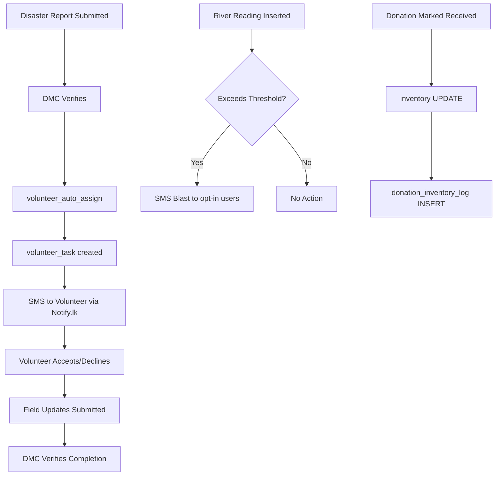

# ResQnet21 — Full Implementation Plan
*(Reconciled against production DB on DigitalOcean, MySQL 8.0.45)*

## Background & Current State

The production database (`defaultdb`) is significantly more advanced than the local [database/schema.sql](file:///c:/Users/oketh/Documents/GitHub/resqnet-php/database/schema.sql). The real DB uses **separate profile tables per role** rather than a single monolithic users table.

### Actual DB Architecture Pattern
```
users (user_id, username, password_hash, email, role, active)
  ├── general_user   (user_id FK → users)
  ├── volunteers     (user_id FK → users)
  ├── ngos           (user_id FK → users)
  ├── grama_niladhari (user_id FK → users)
  └── [dmc — no profile table, managed via users.role = 'dmc']
```

---

## What Already Exists in the DB

| Table | Status | Notes |
|---|---|---|
| [users](file:///c:/Users/oketh/Documents/GitHub/resqnet-php/modules/donations/models.php#184-188) | ✅ Exists | Roles: `general`, `volunteer`, [ngo](file:///c:/Users/oketh/Documents/GitHub/resqnet-php/modules/donations/models.php#184-188), `grama_niladhari`, `dmc` |
| `general_user` | ✅ Exists | Name, contact, address, district, GN division, SMS alert flag |
| `volunteers` | ✅ Exists | Full address, district, GN division, age, gender |
| `skills` + `skills_volunteers` | ✅ Exists | Many-to-many skills per volunteer |
| `volunteer_preferences` + `volunteer_preference_volunteers` | ✅ Exists | Preferred task types |
| `volunteer_task` | ✅ Exists | disaster_id, volunteer_id, role, date_assigned, status |
| `ngos` | ✅ Exists | org name, reg number, years, contact person, email |
| `grama_niladhari` | ✅ Exists | Name, contact, address, GN division, service/division numbers |
| `password_reset_tokens` | ✅ Exists | token, user_id, expires_at, used flag |
| `collection_points` | ✅ Exists | ngo_id FK, name, landmark, address, contact |
| `donation_items_catalog` | ✅ Exists | item_name, category (Medicine/Food/Shelter) |
| [donations](file:///c:/Users/oketh/Documents/GitHub/resqnet-php/modules/donations/models.php#7-24) | ✅ Exists | Item donations with collection_point, time slots, status lifecycle |
| `donation_items` | ✅ Exists | Line items per donation |
| `donation_inventory_log` | ✅ Exists | Audit log for inventory changes |
| `inventory` | ✅ Exists | GENERATED status column (In Stock / Low on Stock / Out of Stock) |
| `donation_requests` | ✅ Exists | GN relief center requests with items |
| `donation_request_items` | ✅ Exists | Items per donation request |
| `disaster_reports` | ✅ Exists | Full report fields, Pending/Approved/Rejected status |
| `safe_locations` | ✅ Exists | lat/lng, name — **missing** capacity & occupancy columns |

### Tables Still Missing

| Table | Needed For |
|---|---|
| `forum_posts` | Community forum |
| `dmc` (profile) | DMC officer profile data |
| `river_basins` | River monitoring |
| `river_thresholds` | SMS trigger thresholds |
| `river_readings` | Current water level readings |
| `volunteer_field_updates` | Volunteer real-time field updates per task |
| `safe_locations` columns | Add `capacity`, `current_occupancy`, `gn_user_id` FK |
| `volunteer_task` columns | Add `task_description`, lifecycle statuses (Pending→Assigned→Accepted→In Progress→Completed→Verified) |
| `supply_requests` | Grama Niladhari supply requests to NGOs |

---

## DB Corrections Needed to Local [schema.sql](file:///c:/Users/oketh/Documents/GitHub/resqnet-php/database/schema.sql)

> [!IMPORTANT]
> The local [database/schema.sql](file:///c:/Users/oketh/Documents/GitHub/resqnet-php/database/schema.sql) is **completely out of sync** with production. Before any PHP module development, the local schema must be replaced with an accurate migration that matches the production DB.

#### [MODIFY] [schema.sql](file:///c:/Users/oketh/Documents/GitHub/resqnet-php/database/schema.sql)

Replace entirely to match production structure, then **append** the missing tables below:

```sql
-- Add to safe_locations
ALTER TABLE safe_locations
  ADD COLUMN capacity INT DEFAULT 0,
  ADD COLUMN current_occupancy INT DEFAULT 0,
  ADD COLUMN managed_by_gn INT NULL,
  ADD COLUMN address VARCHAR(255) NULL,
  ADD FOREIGN KEY (managed_by_gn) REFERENCES grama_niladhari(user_id) ON DELETE SET NULL;

-- Volunteer task lifecycle expansion
ALTER TABLE volunteer_task
  ADD COLUMN task_description TEXT NULL,
  MODIFY COLUMN status ENUM('Pending','Assigned','Accepted','In Progress','Completed','Verified') DEFAULT 'Assigned';

-- Volunteer field updates
CREATE TABLE IF NOT EXISTS volunteer_field_updates (
  update_id INT AUTO_INCREMENT PRIMARY KEY,
  task_id INT NOT NULL,
  volunteer_id INT NOT NULL,
  update_text TEXT NOT NULL,
  image_path VARCHAR(255) NULL,
  submitted_at TIMESTAMP DEFAULT CURRENT_TIMESTAMP,
  FOREIGN KEY (task_id) REFERENCES volunteer_task(id) ON DELETE CASCADE,
  FOREIGN KEY (volunteer_id) REFERENCES volunteers(user_id) ON DELETE CASCADE
);

-- Supply requests (GN → NGO)
CREATE TABLE IF NOT EXISTS supply_requests (
  request_id INT AUTO_INCREMENT PRIMARY KEY,
  gn_user_id INT NOT NULL,
  item_id INT NOT NULL,
  category ENUM('Medicine','Food','Shelter') NOT NULL,
  headcount INT NOT NULL,
  duration_days INT NOT NULL,
  calculated_quantity INT NOT NULL,
  status ENUM('Pending','Fulfilled','Cancelled') DEFAULT 'Pending',
  notes TEXT NULL,
  submitted_at TIMESTAMP DEFAULT CURRENT_TIMESTAMP,
  fulfilled_at TIMESTAMP NULL,
  fulfilled_by_ngo INT NULL,
  FOREIGN KEY (gn_user_id) REFERENCES grama_niladhari(user_id) ON DELETE CASCADE,
  FOREIGN KEY (item_id) REFERENCES donation_items_catalog(item_id) ON DELETE CASCADE,
  FOREIGN KEY (fulfilled_by_ngo) REFERENCES ngos(user_id) ON DELETE SET NULL
);

-- Forum posts
CREATE TABLE IF NOT EXISTS forum_posts (
  post_id INT AUTO_INCREMENT PRIMARY KEY,
  user_id INT NOT NULL,
  title VARCHAR(200) NOT NULL,
  body TEXT NOT NULL,
  image_path VARCHAR(255) NULL,
  status ENUM('Pending','Approved','Rejected') DEFAULT 'Pending',
  submitted_at TIMESTAMP DEFAULT CURRENT_TIMESTAMP,
  approved_at TIMESTAMP NULL,
  FOREIGN KEY (user_id) REFERENCES users(user_id) ON DELETE CASCADE
);

-- River monitoring
CREATE TABLE IF NOT EXISTS river_basins (
  basin_id INT AUTO_INCREMENT PRIMARY KEY,
  basin_name VARCHAR(150) NOT NULL,
  gauge_station VARCHAR(150) NOT NULL,
  district VARCHAR(100) NOT NULL
);

CREATE TABLE IF NOT EXISTS river_thresholds (
  basin_id INT NOT NULL PRIMARY KEY,
  alert_level DECIMAL(8,2) NOT NULL,
  warning_level DECIMAL(8,2) NOT NULL,
  danger_level DECIMAL(8,2) NOT NULL,
  FOREIGN KEY (basin_id) REFERENCES river_basins(basin_id) ON DELETE CASCADE
);

CREATE TABLE IF NOT EXISTS river_readings (
  reading_id INT AUTO_INCREMENT PRIMARY KEY,
  basin_id INT NOT NULL,
  water_level DECIMAL(8,2) NOT NULL,
  recorded_at TIMESTAMP DEFAULT CURRENT_TIMESTAMP,
  FOREIGN KEY (basin_id) REFERENCES river_basins(basin_id) ON DELETE CASCADE
);

-- DMC officer profile
CREATE TABLE IF NOT EXISTS dmc (
  user_id INT NOT NULL PRIMARY KEY,
  name VARCHAR(150) NOT NULL,
  contact_number VARCHAR(20) DEFAULT NULL,
  department VARCHAR(100) DEFAULT NULL,
  FOREIGN KEY (user_id) REFERENCES users(user_id) ON DELETE CASCADE
);
```

---

## PHP Module Implementation

> [!NOTE]
> The existing PHP codebase still references the **old** [users](file:///c:/Users/oketh/Documents/GitHub/resqnet-php/modules/donations/models.php#184-188) table structure (single table with `id`, `name`, `email`, `password`, `role`). All modules must be rewritten to use the **new** multi-table structure ([users](file:///c:/Users/oketh/Documents/GitHub/resqnet-php/modules/donations/models.php#184-188) + role-profile tables, `user_id` as PK, `password_hash` column name).

---

### Phase 1 — Auth Module Rewrite

#### [MODIFY] [controllers.php](file:///c:/Users/oketh/Documents/GitHub/resqnet-php/modules/auth/controllers.php)

The current auth module uses the old schema. Must be fully rewritten:

- **Login**: Query [users](file:///c:/Users/oketh/Documents/GitHub/resqnet-php/modules/donations/models.php#184-188) by `username` OR `email`, verify `password_hash`; role-based dashboard redirect
- **Register**: Multi-step or tabbed form
  - Role selection: `general` / `volunteer` / [ngo](file:///c:/Users/oketh/Documents/GitHub/resqnet-php/modules/donations/models.php#184-188)
  - Common fields: username, email, password
  - Role-specific fields: inserted into `general_user` / `volunteers` / `ngos` after [users](file:///c:/Users/oketh/Documents/GitHub/resqnet-php/modules/donations/models.php#184-188) INSERT
  - NGO registrations require DMC approval (`users.active = 0` until approved)
- **Password Reset**: `password_reset_tokens` table already exists; implement email token flow
- **Profile edit**: Update role-profile table fields + `users.email`/`password_hash`
- **SMS Opt-in**: Toggle `general_user.sms_alert` flag

#### [MODIFY] [models.php](file:///c:/Users/oketh/Documents/GitHub/resqnet-php/modules/auth/models.php)

- `auth_find_by_identifier(string $usernameOrEmail)` — query [users](file:///c:/Users/oketh/Documents/GitHub/resqnet-php/modules/donations/models.php#184-188) table
- `auth_get_profile(int $userId, string $role)` — join users + role-profile table
- `auth_create_user(array $data, string $role)` — transaction: INSERT users + role-profile

---

### Phase 2 — Dashboard Module

#### [MODIFY] [modules/dashboard/controllers.php](file:///c:/Users/oketh/Documents/GitHub/resqnet-php/modules/dashboard/controllers.php)

Route `/dashboard` to role-specific sub-views:

| Role | Dashboard View |
|---|---|
| `general` | My disaster reports, my donations, forum posts |
| `volunteer` | Assigned tasks (from `volunteer_task`), task status, field update links |
| [ngo](file:///c:/Users/oketh/Documents/GitHub/resqnet-php/modules/donations/models.php#184-188) | Item donations, inventory summary, supply requests from GN |
| `grama_niladhari` | Safe location occupancy, supply request form |
| `dmc` | Stats overview: pending reports, pending volunteers, river alerts |

#### [NEW] [views/layouts/dashboard.php](file:///c:/Users/oketh/Documents/GitHub/resqnet-php/views/layouts/dashboard.php)

Sidebar layout with role-aware navigation.

---

### Phase 3 — Disaster Reports Module

#### [MODIFY] `modules/disaster_reports/` *(rename/reconcile from existing `warnings` module)*

The existing `warnings` module covers DMC-issued early warnings. Disaster reports (submitted by public) are **separate**.

**Public submit** (`/report-disaster`):
- Fields match `disaster_reports` table: reporter_name, contact_number, disaster_type (ENUM + other), datetime, location, proof image, description
- Guest submit allowed (user_id = guest user or nullable — check schema `user_id NOT NULL`: requires login or a guest user record)

> [!WARNING]
> `disaster_reports.user_id` has `NOT NULL` with FK to `general_user`. **Anonymous public reporting requires login or a dedicated `guest_user_id` seeded in the DB.** Clarification needed — the plan assumes we require login for reporting, or use a shared anonymous general_user record.

**DMC queue** (`/dashboard/reports`):
- List pending reports
- Approve → sets `status = 'Approved'`, `verified_at = NOW()`, **triggers volunteer task assignment**
- Reject → sets `status = 'Rejected'`

---

### Phase 4 — Volunteer Module

The `volunteer_task` table links `volunteer_id` → `disaster_id`. All queries must join `disaster_reports` + `volunteers`.

**Automated Assignment Engine** (PHP function called on disaster approval):
```
function volunteer_auto_assign(int $disasterId): void
1. Load disaster district from disaster_reports.location (or parsed field)
2. Find approved volunteers: SELECT volunteers WHERE district MATCHES
3. Filter by skills_volunteers matching required skills for disaster_type
4. Order by current active task count (workload balance)
5. INSERT volunteer_task(volunteer_id, disaster_id, role, status='Assigned')
6. Send SMS via sms_send() if volunteer's user has sms_alert=1
```

**Volunteer dashboard**:
- View tasks: JOIN volunteer_task + disaster_reports
- Accept/Decline: UPDATE volunteer_task.status
- Field updates: INSERT volunteer_field_updates

**DMC Task Oversight**:
- All tasks view with status filter
- Manual reassign: UPDATE volunteer_task.volunteer_id
- Verify completion: UPDATE volunteer_task.status = 'Verified'

---

### Phase 5 — NGO Module

Uses existing [donations](file:///c:/Users/oketh/Documents/GitHub/resqnet-php/modules/donations/models.php#7-24), `donation_items`, `inventory`, `collection_points` tables.

**Item Donations Flow**:
- `donations.status`: Pending → Received (triggers inventory update) / Cancelled / Delivered
- On mark-received: UPDATE `inventory.quantity` += donation_items.quantity (per item), INSERT `donation_inventory_log`

**Inventory**:
- `status` is GENERATED (computed column) — PHP only needs to read, not write it
- Manual adjustment: UPDATE `inventory.quantity` directly + INSERT log

**Supply Request fulfillment**:
- NGO views `supply_requests` from GN, marks as fulfilled → UPDATE inventory accordingly

---

### Phase 6 — Grama Niladhari Module

**Supply Requests**:
- Auto-calculate: e.g., Food = `headcount × duration_days × 3` (meals), Medicine = `headcount × duration_days`, Shelter = `ceil(headcount / 4)` (tarps)
- INSERT `supply_requests`

**Safe Locations**:
- UPDATE `safe_locations.current_occupancy` (after ALTER TABLE adds this column)
- View all locations in their district

---

### Phase 7 — DMC Module

All existing warnings module routes remain. Extensions:

- **Verify reports** → triggers `volunteer_auto_assign()`
- **Approve volunteers**: UPDATE `users.active = 1` for volunteer/NGO accounts
- **GN account management**: INSERT/UPDATE/deactivate in [users](file:///c:/Users/oketh/Documents/GitHub/resqnet-php/modules/donations/models.php#184-188) + `grama_niladhari` tables
- **River monitoring**: CRUD on `river_basins`, `river_thresholds`, `river_readings`; check thresholds on reading insert → trigger SMS
- **Forum moderation**: Approve/Reject `forum_posts.status`
- **Reporting dashboard**: Aggregate queries across donations, tasks, inventory
- **Confirm NGO deliveries**: UPDATE `donations.status = 'Delivered'`, `delivered_at = NOW()`

---

### Phase 8 — Forum Module (NEW)

#### [NEW] `modules/forum/`

- Public: Show `forum_posts WHERE status = 'Approved'` ORDER BY submitted_at DESC
- Auth users: Submit post → status = 'Pending'
- DMC: Approve/Reject/Edit posts

---

### Phase 9 — API Integrations

#### [NEW] `modules/weather/`

**Open-Meteo** (`https://api.open-meteo.com/v1/forecast`):
- Parameters: `latitude`, `longitude`, `hourly=precipitation`, `forecast_days=7`
- Fetch via PHP `file_get_contents()` or `curl`
- Display with **Chart.js** rainfall bar chart
- Flood risk: < 10mm/day = Low, 10–30mm = Moderate, > 30mm = High

#### [NEW] `modules/safe_locations/`

**Leaflet.js + OpenStreetMap**:
- `/api/safe-locations` → JSON of all safe_locations rows (after adding capacity/occupancy columns)
- Map page renders markers with popup: name, capacity, occupancy, availability

#### [NEW] `core/sms.php`

**Notify.lk**:
```php
function sms_send(string $phone, string $message): bool {
  // POST to https://app.notify.lk/api/v1/send
  // Params: user_id, api_key, sender_id, to, message
}
```
Called from: disaster threshold breach, volunteer assignment, supply request alerts.

---

### Phase 10 — UI / Layout

#### [MODIFY] [main.php](file:///c:/Users/oketh/Documents/GitHub/resqnet-php/views/layouts/main.php)

Update public nav: Home | Weather | Report Disaster | Donate | Safe Locations | Forum | Sign In

#### [NEW] [views/layouts/dashboard.php](file:///c:/Users/oketh/Documents/GitHub/resqnet-php/views/layouts/dashboard.php)

Role-aware sidebar nav (see Phase 2 table). Responsive with mobile hamburger toggle.

#### Public pages needed:
- `/` — Landing page with weather summary widget, recent alerts, quick links
- `/weather` — Full 7-day rainfall forecast dashboard  
- `/report-disaster` — Public disaster report form
- `/donate-items` — Public item donation form (with collection point selector)
- `/safe-locations` — Leaflet map
- `/forum` — Community forum listing

---

## Critical Integration Points



---

## Verification Plan

### Prerequisites
- Local [.env](file:///c:/Users/oketh/Documents/GitHub/resqnet-php/.env) must point to the DigitalOcean DB (or a local clone with the production schema applied)
- Run: `php -S localhost:8000 -t public` from project root

### Browser Tests per Role Flow

| Flow | Steps |
|---|---|
| Register as volunteer | `/register` → select Volunteer → fill form → check `volunteers` table |
| Login by username | `/login` → enter username → verify role-based redirect |
| Password reset | `/forgot-password` → email → token link → reset → verify `password_hash` updated |
| DMC approves disaster | Login DMC → `/dashboard/reports` → approve → check `volunteer_task` row created |
| Volunteer accepts task | Login volunteer → `/dashboard/my-tasks` → accept → submit field update |
| NGO receives donation | Login NGO → mark received → check `inventory.quantity` increased |
| GN supply request | Login GN → submit → verify NGO sees it in `/dashboard/ngo/supply-requests` |
| Weather chart loads | Visit `/weather` → verify Open-Meteo API response renders Chart.js |
| Map loads | Visit `/safe-locations` → verify Leaflet map with shelter markers |
| Forum post flow | Submit post → DMC approves → post visible publicly |

### RBAC Spot Checks
- [ngo](file:///c:/Users/oketh/Documents/GitHub/resqnet-php/modules/donations/models.php#184-188) accessing `/dashboard/dmc/*` → 403/redirect
- `volunteer` accessing `/dashboard/ngo/*` → 403/redirect
- Unauthenticated accessing `/dashboard` → redirect to `/login`
